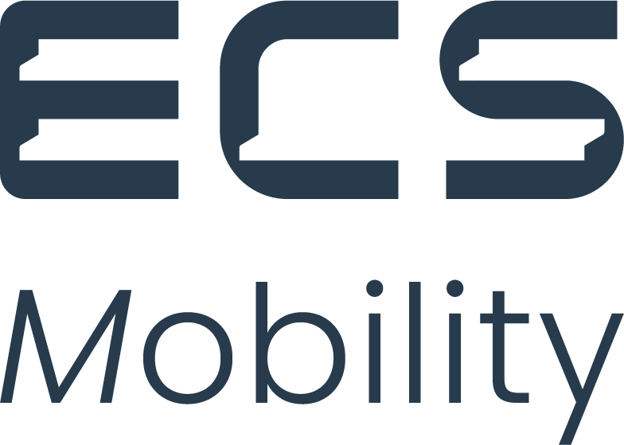

<!-- Banner superior animado -->

<!-- Descomentar cuando el logo este en profile/assets/logo.png -->
<!--  -->

 

**Diseñamos, desarrollamos y mantenemos soluciones digitales que transforman datos en decisiones.**

---

## Sobre nosotros

Somos el equipo de **Transformacion Digital** dentro de ECS-Mobility. Nuestro trabajo abarca desde el analisis de datos de produccion hasta la creacion de cuadros de mando interactivos para cada departamento de la organizacion.

Creemos en la toma de decisiones basada en datos, la automatizacion de procesos y la mejora continua.

## Que hacemos

| Area | Descripcion |
|------|-------------|
| **Analisis de datos de produccion** | Recopilacion, procesamiento y visualizacion de datos operativos para optimizar procesos productivos |
| **Cuadros de mando** | Dashboards interactivos por departamento que ofrecen visibilidad en tiempo real de KPIs clave |
| **Automatizacion de procesos** | Desarrollo de herramientas y flujos que eliminan tareas manuales y reducen errores |
| **Integracion de sistemas** | Conexion entre plataformas internas para garantizar un flujo de datos coherente y fiable |

## Tecnologias

## Actividad

<!-- Generado automaticamente por GitHub Actions (ver .github/workflows/metrics.yml) -->

---

*Transformando datos en valor.*

<!-- Banner inferior animado -->

